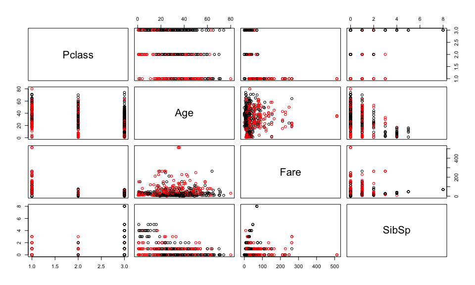
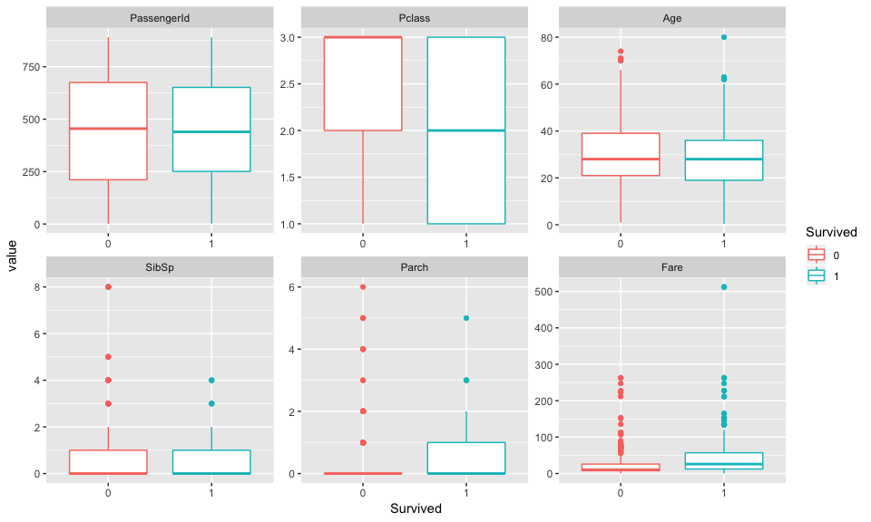
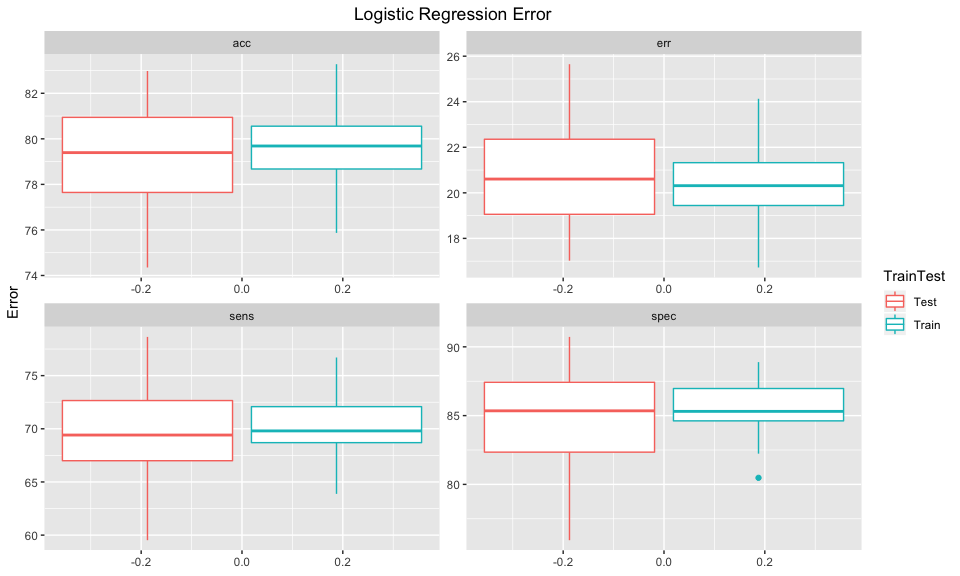

Titanic Kaggle Submission
================

For this project the goal is to predict whether or not a passenger
survived the sinking of the Titanic using a number of different features
such as the fare they paid, the class they were in and their age. You
can view the full description of this project at
<https://www.kaggle.com/c/titanic>.

### Read Data

``` r
df_train=read.table("train.csv",sep=",",header=TRUE)
df_test=read.table("test.csv",sep=",",header=TRUE)
summary(df_train)
```

    ##   PassengerId       Survived          Pclass     
    ##  Min.   :  1.0   Min.   :0.0000   Min.   :1.000  
    ##  1st Qu.:223.5   1st Qu.:0.0000   1st Qu.:2.000  
    ##  Median :446.0   Median :0.0000   Median :3.000  
    ##  Mean   :446.0   Mean   :0.3838   Mean   :2.309  
    ##  3rd Qu.:668.5   3rd Qu.:1.0000   3rd Qu.:3.000  
    ##  Max.   :891.0   Max.   :1.0000   Max.   :3.000  
    ##                                                  
    ##                                     Name         Sex           Age       
    ##  Abbing, Mr. Anthony                  :  1   female:314   Min.   : 0.42  
    ##  Abbott, Mr. Rossmore Edward          :  1   male  :577   1st Qu.:20.12  
    ##  Abbott, Mrs. Stanton (Rosa Hunt)     :  1                Median :28.00  
    ##  Abelson, Mr. Samuel                  :  1                Mean   :29.70  
    ##  Abelson, Mrs. Samuel (Hannah Wizosky):  1                3rd Qu.:38.00  
    ##  Adahl, Mr. Mauritz Nils Martin       :  1                Max.   :80.00  
    ##  (Other)                              :885                NA's   :177    
    ##      SibSp           Parch             Ticket         Fare       
    ##  Min.   :0.000   Min.   :0.0000   1601    :  7   Min.   :  0.00  
    ##  1st Qu.:0.000   1st Qu.:0.0000   347082  :  7   1st Qu.:  7.91  
    ##  Median :0.000   Median :0.0000   CA. 2343:  7   Median : 14.45  
    ##  Mean   :0.523   Mean   :0.3816   3101295 :  6   Mean   : 32.20  
    ##  3rd Qu.:1.000   3rd Qu.:0.0000   347088  :  6   3rd Qu.: 31.00  
    ##  Max.   :8.000   Max.   :6.0000   CA 2144 :  6   Max.   :512.33  
    ##                                   (Other) :852                   
    ##          Cabin     Embarked
    ##             :687    :  2   
    ##  B96 B98    :  4   C:168   
    ##  C23 C25 C27:  4   Q: 77   
    ##  G6         :  4   S:644   
    ##  C22 C26    :  3           
    ##  D          :  3           
    ##  (Other)    :186

``` r
dim(df_train)
```

    ## [1] 891  12

### Exploratory Analysis

``` r
# categorize variables as Categorical and Numerical
cat_var = c('Sex','Parch','Cabin','Embarked','Ticket','Name')
num_var = c('Pclass','Age','Fare','SibSp')
head(df_train[,cat_var])
```

    ##      Sex Parch Cabin Embarked           Ticket
    ## 1   male     0              S        A/5 21171
    ## 2 female     0   C85        C         PC 17599
    ## 3 female     0              S STON/O2. 3101282
    ## 4 female     0  C123        S           113803
    ## 5   male     0              S           373450
    ## 6   male     0              Q           330877
    ##                                                  Name
    ## 1                             Braund, Mr. Owen Harris
    ## 2 Cumings, Mrs. John Bradley (Florence Briggs Thayer)
    ## 3                              Heikkinen, Miss. Laina
    ## 4        Futrelle, Mrs. Jacques Heath (Lily May Peel)
    ## 5                            Allen, Mr. William Henry
    ## 6                                    Moran, Mr. James

Create pairs plot of numerical variables and color depending on whether
or not the person survived. Red indicates a survivor.

``` r
pairs_color <- function(cls,clr){
  
  cols <- character(length(cls))
  cols[] <- "black"
  cols[cls== 1] <- clr
  # return color vector
  cols
}
```

``` r
pairs(df_train[,num_var],col=pairs_color(df_train$Survived,'red'))
```

<!-- -->

``` r
table(df_train$Survived)
```

    ## 
    ##   0   1 
    ## 549 342

Using Boxplots:

``` r
# convert outcome class to factor
df_train$Survived = as.factor(df_train$Survived)
# create boxplots
ggplot(melt(df_train),aes(x=Survived,y=value,colour=Survived)) + geom_boxplot() + facet_wrap(~variable,nrow=2,scales="free")
```

    ## Using Survived, Name, Sex, Ticket, Cabin, Embarked as id variables

    ## Warning: Removed 177 rows containing non-finite values (stat_boxplot).

<!-- -->

### Data cleaning

Before attempting any fitting of the model we’ll need to clean up the
data.

``` r
# replace NAs with 0
df_train[is.na(df_train)] <- 0 
df_test[is.na(df_test)] <- 0 

# add cabin code
df_train$Cabin_Code=substring(df_train$Cabin,1,1)
df_train[df_train$Cabin_Code=='',]$Cabin_Code='N'
df_train[df_train$Cabin_Code=='T',]$Cabin_Code='N'
df_train$Cabin_Code = factor(df_train$Cabin_Code)

df_test$Cabin_Code=substring(df_test$Cabin,1,1)
df_test[df_test$Cabin_Code=='',]$Cabin_Code='N'
df_test$Cabin_Code = factor(df_test$Cabin_Code)

# Impute Embarked Missing Values
levels(df_train$Embarked)[levels(df_train$Embarked)==""] <- "S"
levels(df_train$Embarked)[levels(df_train$Embarked)=="T"] <- "S"
levels(df_test$Embarked)[levels(df_test$Embarked)==""] <- "S"
```

Although the name feature contains too many classes to be a useful
feature, there should be some useful information we can extract out of
it such as the Title for each passenger.

``` r
# extract title
df_train$Title<-regmatches(as.character(df_train$Name),regexpr("\\,[A-z ]{1,20}\\.", as.character(df_train$Name)))
df_train$Title<-unlist(lapply(df_train$Title,FUN=function(x) substr(x, 3, nchar(x)-1)))

df_test$Title<-regmatches(as.character(df_test$Name),regexpr("\\,[A-z ]{1,20}\\.", as.character(df_test$Name)))
df_test$Title<-unlist(lapply(df_test$Title,FUN=function(x) substr(x, 3, nchar(x)-1)))
#table(df_train$Title)

df_train$Title[which(df_train$Title %in% c("Mme", "Mlle","Ms"))] <- "Miss"
df_train$Title[which(df_train$Title %in% c("Capt", "Col","Major"))] <- "Mil"
df_train$Title[which(df_train$Title %in% c("Don", "Lady","Sir","the Countess"))] <- "VIP"
# some googling reveals Jonkheer to be a title of low-ranking nobility within the Netherlands...
df_train$Title[which(df_train$Title %in% c("Jonkheer"))] <- "Master"

df_test$Title[which(df_test$Title %in% c("Mme", "Mlle","Ms"))] <- "Miss"
df_test$Title[which(df_test$Title %in% c("Capt", "Col","Major"))] <- "Mil"
df_test$Title[which(df_test$Title %in% c("Don", "Lady","Sir","the Countess","Dona"))] <- "VIP"
df_test$Title[which(df_test$Title %in% c("Jonkheer"))] <- "Master"


# I came across some rank deficiency errors when training the model so I'm going to group any title with a count less than 10 into 'other'
df_train$Title[which(df_train$Title %in% c("Dr", "Mil","Rev","VIP"))] <- "Other"
df_test$Title[which(df_test$Title %in% c("Dr", "Mil","Rev","VIP"))] <- "Other"

df_train$Title = as.factor(df_train$Title)
df_test$Title = as.factor(df_test$Title)
table(df_train$Title)
```

    ## 
    ## Master   Miss     Mr    Mrs  Other 
    ##     41    186    517    125     22

``` r
table(df_test$Title)
```

    ## 
    ## Master   Miss     Mr    Mrs  Other 
    ##     21     79    240     72      6

### Model Training

The following function will be used to calculate Error, Accuracy,
Sensitivity and Specificity for each
model.

``` r
summPreds <- function(inpPred,inpTruth,inpMetrNms=c("err","acc","sens","spec")) {
  retVals <- numeric()
  for ( metrTmp in inpMetrNms ) {
    retVals[metrTmp] <- performance(ROCR::prediction(inpPred,inpTruth),measure=metrTmp)@y.values[[1]][2]
  }
  retVals
}
```

Below we will try to fit the logistic regression model and will use
bootstrapping of the training sample to help give us a better estimate
of the training and test error.

``` r
set.seed(1)
dfTmpLR <- NULL
for ( i in 1:50) { # for each group:
    # create bootstrapped sample
    trainIdx <- sample(nrow(df_train),nrow(df_train),replace=TRUE)
    # train and fit model
    data.train = df_train[trainIdx,]
    data.test = df_train[-trainIdx,]
    lr.fit = glm(Survived~Pclass+Sex+Age+SibSp+Embarked,data=data.train,family=binomial)
    #train error
    glm.probs = predict(lr.fit,data.train,type="response")
    glm.pred=rep(0,nrow(data.train))
    glm.pred[glm.probs>.5]=1
    TrainErr = summPreds(as.numeric(glm.pred),as.numeric(data.train$Survived))
    #test error
    glm.probs.test = predict(lr.fit,data.test,type="response")
    glm.pred.test=rep(0,nrow(data.test))
    glm.pred.test[glm.probs.test>.5]=1
    TestErr = summPreds(glm.pred.test,as.numeric(data.test$Survived))
    
    dfTmpLR = rbind(dfTmpLR,data.frame(run=i,model='LR',metric=c(names(TrainErr),names(TestErr)),value=c(TrainErr,TestErr),TrainTest=c('Train','Train','Train','Train','Test','Test','Test','Test')))
}
ggplot(data=dfTmpLR,aes(y=100*value,colour=TrainTest)) +
geom_boxplot() +
facet_wrap(~metric,scales='free') +
labs(y='Error') + 
ggtitle("Logistic Regression Error") + theme(plot.title = element_text(hjust = 0.5))
```

<!-- -->

Code to write to submissions final file included
below:

``` r
#final.predictions = data.frame(cbind(df_test[,'PassengerId'],as.factor(lrPred)))
#colnames(final.predictions) = c('PassengerId','Survived')
#final.predictions$Survived = ifelse(final.predictions$Survived==2,1,0) 
#write.csv(final.predictions,'kaggle/titanic/all/titanic_predictions_LR.csv',row.names = FALSE)
```
